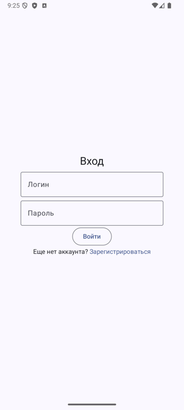

# ПРИДАНОЕ

Мобильное приложение программного продукта "ПРИДАНОЕ". Сверверное приложение расположено в [другом репозитории](https://github.com/Andryss/Trousseau-backend).

## Запуск

Для запуска приложения необходимо настроить и запустить [серверную часть приложения](https://github.com/Andryss/Trousseau-backend#запуск).

После настройки необходимых компонентов нужно заполнить файл [app.properties.example](app/src/main/assets/app.properties.example) и переименовать в `app.properties`.

Запустить приложение можно при помощи [инструкции для запуска Android приложений](https://developer.android.com/build/building-cmdline).

## О приложении

Приложение создано для [платформы Android](https://developer.android.com/develop) и использует HTTP REST API интерфейс, реализованный серверным приложением.

## Экраны

1. Страница регистрации
    
    
    

2. Страница входа
   
   

3. Главная страница
   

4. Страница поиска объявлений
   
   
   

5. Страница объявления
   

6. Страница профиля
   
   

7. Страница уведомлений
   
   
   

8. Страница подписок
   
   
   
   

9. Страница избранного
   
   

10. Страница бронирований
   
   

11. Страница моих объявлений
    
    
    

12. Страница редактирования объявления
    
    
    

13. Страница предпросмотра объявления
    
    
